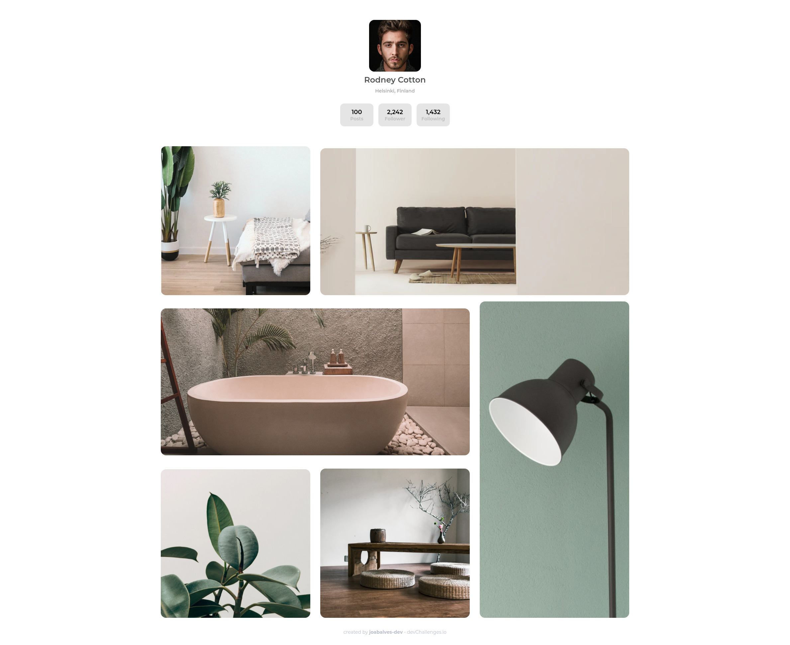
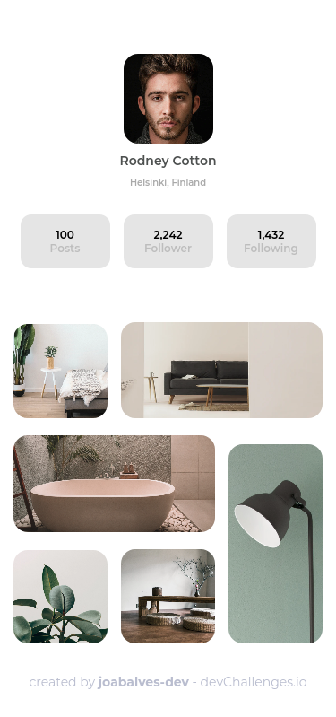

<!-- Please update value in the {}  -->

<h1 align="center">My-Gallery</h1>

   Solution for a challenge from  <a href="http://devchallenges.io" target="_blank">Devchallenges.io</a>.

  <h3>
    <a href="https://devs.natal.br/devchallenges/my-galley-master">
      Demo
    </a>
     | 
    <a href="https://github.com/joabalves-dev/my-gallery-master">
      Solution
    </a>
     | 
    <a href="https://devchallenges.io/portfolio/joabalves-dev">
      Challenge
    </a>
  </h3>

<!-- TABLE OF CONTENTS -->

## Table of Contents

- [Overview](#overview)
  - [Built With](#built-with)
- [Features](#features)
- [Contact](#contact)

<!-- OVERVIEW -->

## Descktop

## Mobile

## Contact

- Website [devs.natal.br](https://devs.natal.br)
- GitHub [@joabalves-dev](https://github.com/joabalves-dev/)

